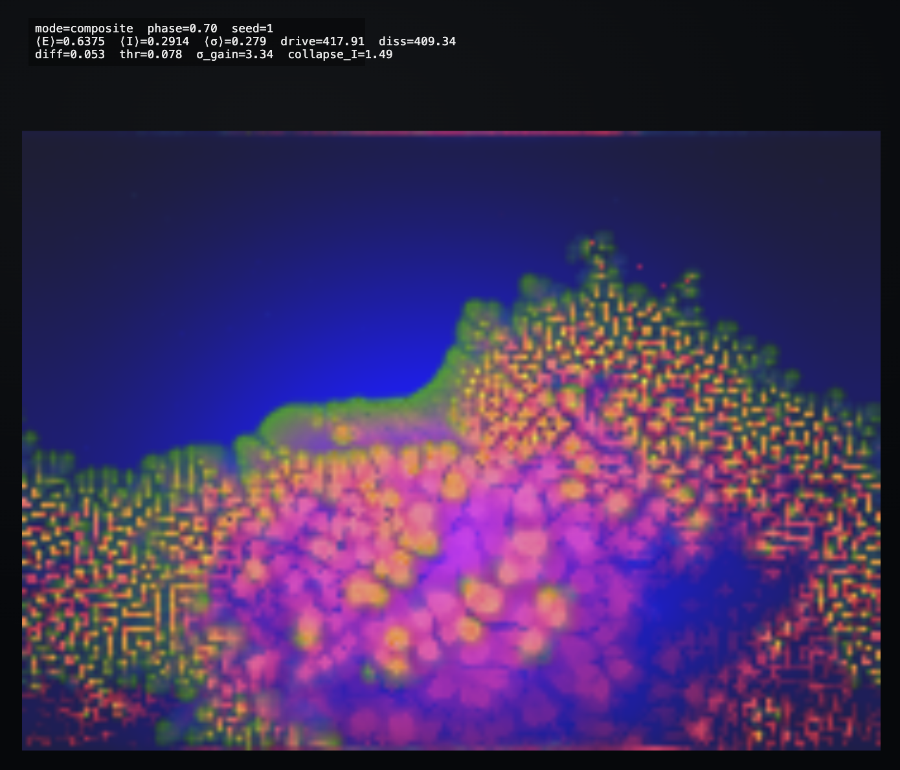

# Energy–Information–Structure Simulator

https://information-dynamics.netlify.app/


This project explores a **minimal local mechanism** that can produce multiple dynamical regimes where large‑scale structure emerges without agents, goals, or optimization.

**Core novelty:** a local energy–information–structure loop where information and structure are *energetically paid* states of flow.
- **Energy (E)** is a local potential that is injected, transported, and dissipated.
- **Information (I)** is stored anomalous energy flux: it appears only when transported flow exceeds what smooth diffusion can absorb, and it costs energy to exist.
- **Structure (σ)** is a paid constraint on flow: it modifies conductance, costs energy to write and maintain, and relaxes if unsupported.
These three quantities continuously transform into one another through purely local accounting, without agents, goals, or optimization.

<br/>

<p align="center">
  
</p>

<br/>

This is a **substrate‑level dynamical model** built from local diffusion, flux‑thresholded information, hysteretic structure, and collapse on a driven grid. The current demo (`index.html`) runs on a 2D torus grid with degree‑normalized flux.


<br/>

## Core idea

The simulation is built on a single loop:

> **Energy potential → flux → information → structure → modified flux**

Structure is not injected. Information is not symbolic. Everything emerges from **local energy flow under cost and dissipation**.

```text
        energy (E)
            |
            v
   gradient-driven flux
            |
            v
     information (I)
            |
            v
      structure (σ)
            |
            v
   modified conductance
            |
            +----> back to flux
```

The key idea:

> **Information and structure are costly organizations of energetic flow — not separate from energy.**


<br/>

## State variables (per cell)

Each cell stores three continuous quantities:

- **E — Energy potential**  
  A local free‑energy–like budget. Gradients of E drive flow. E may be negative, representing *energy debt*.

- **I — Information**  
  A persistent, energetically paid memory of *unusually strong energy flux*. I is created by flux, decays over time, and can collapse.

- **σ — Structure**  
  Stored constraint (conductance) that reshapes future energy flow. Structure is costly to write and maintain.


<br/>

## Local rules (informal)

1. **Open system**  
   Energy is injected externally (a moving drive) and dissipated locally.

2. **Energy diffusion**  
   Energy flows down gradients. The amount of flow depends on local structure (σ).

3. **Flux → Information**  
   When local energy flux exceeds a baseline, information is created, this creation costs energy and is limited by available E (predicted E after the current step).

4. **Information decay**  
   Information decays unless reinforced, refunding its energetic cost.

5. **Information → Structure**  
   Sustained information slowly writes structure (σ) via hysteresis. Structure is expensive to create and maintain.

6. **Collapse**  
   Excessive information triggers collapse: a release budget is taken from available E, structure weakens, and energy is redistributed locally with jittered (random) weights. A rare non‑local jump can move part of that same release to a random cell.

All rules are **local**, **continuous**, and **energetically accounted**.


<br/>

## Model equations (index.html)

Per cell i with neighbors j in N(i). Discrete-time form. These match the current demo; other variants may differ.

**Energy drive + evaporation (accumulate dE)**
```text
dE_i += D_i(t) - eps * max(E_i, 0)
```
<br>


**Structure-dependent diffusion (accumulate dE)**
```text
g_ij = sigma0 + sigmag * clip(sigma_i, 0, 1) * clip(sigma_j, 0, 1)

F_ij = kappa * g_ij * (E_j - E_i)

dE_i += sum_{j in N(i)} F_ij

```
<br>

**Flux magnitude (local “surprise”)**
```text
Phi_i = (1/|N(i)|) * sum_{j in N(i)} |E_j - E_i|

```
<br>

**Flux -> Information (I), costly condensation (accumulate dE, dI)**
```text
G_i = alphaI * max(0, Phi_i - thetaI) ^ pI

available = max(E_i + dE_i*dt, 0)
affordable fraction a_i = min(1, available / (cI*G_i*dt + tiny))

applied = a_i * G_i

dI_i += applied
dE_i -= cI * applied
```
<br>

**Information decay (refund; accumulate dE, dI)**
```text
dI_i -= lambdaI * I_i
dE_i += cI * lambdaI * I_i
```
<br>

**Integrate E and I**
```text
E_i <- E_i + dE_i * dt
I_i <- max(0, I_i + dI_i * dt)
```
<br>

**Information -> Structure (sigma), hysteresis + cost**
```text
if I_i >= theta_on:   ds = etaS * (I_i - theta_on)

else if I_i <= theta_off: ds = etaS * (I_i - theta_off)

else:                 ds = 0

sigma*_i = clip(sigma_i + ds * dt, 0, 1)

write = max(0, sigma*_i - sigma_i)

payW = min(max(E_i,0), cSigma * write)

sigma_i <- sigma_i + write * (payW / (cSigma*write + tiny))

E_i <- E_i - payW
```
<br>

**Structure maintenance + relaxation**
```text
payM = min(max(E_i,0), cMaint * sigma_i)
E_i <- E_i - payM

relax = lambdaS * sigma_i
sigma*_i = clip(sigma_i - relax, 0, 1)

E_i <- E_i + (sigma_i - sigma*_i) * cSigma * 0.6
sigma_i <- sigma*_i
```
<br>

**Collapse (punctuated recycling)**
```text
if I_i >= I_col:
  R_i = min(max(E_i,0), fC * I_i * cI)

  I_i <- max(0, I_i - R_i / cI)
  if I_i < theta_off: sigma_i <- 0.5 * sigma_i

  E_i <- E_i - R_i

  redistribute R_i to neighbors with weights w_ij (sum_j w_ij = 1)

  optional nonlocal jump (conservative transport, drawn from R_i):
    if rand() < p_jump:
      E_k <- E_k + 0.5 * R_i
      E_i <- E_i - 0.5 * R_i
```


<br/>

## What the simulation shows

The dynamics show qualitative emergence. In many regimes, energy flow builds structure, structure redirects flow, and feedback keeps the system dynamic. The outcome depends on parameters to tune, ranging from smooth diffusion to patterned or punctuated activity.


<br/>

## Interpretation

- **Energy (E)** is a free‑energy–like potential
- **Flux** is energy in motion
- **Information (I)** is stored surprise in energy flow
- **Structure (σ)** is frozen information that reshapes flow

Structure exists only because energy continuously pays for it. Collapse is not failure — it is essential for renewal.


<br/>

## Controls

## Quickstart

- Open `index.html` in a browser.
- Use keys **1–4** to switch views (E / I / σ / composite).
- **Space** pauses, **R** resets, **P** toggles phase‑lock.
- The Phase slider sweeps a coordinated parameter map across regimes.
- Advanced sliders expose all parameters.

## Controls

- View modes: energy / information / structure / composite
- Parameters control diffusion, thresholds, costs, and collapse
- A single phase‑like control can sweep through regimes
- The bottom chart in `index.html` plots ΣI(t) and Σσ(t), showing total information and total structure over time.

<br/>


## Todo

- [ ] Add short parameter descriptions
- [ ] Explain the main controls
- [ ] Add a few basic metrics

<br/>


## Summary

> **This simulation explores the minimal local conditions under which energy flow can give rise to information, structure, collapse, and diverse emergent regimes.**

<br/>

## License

This work is licensed under the Creative Commons Attribution-NonCommercial-ShareAlike 4.0 International License.
See `LICENSE` or https://creativecommons.org/licenses/by-nc-sa/4.0/.
